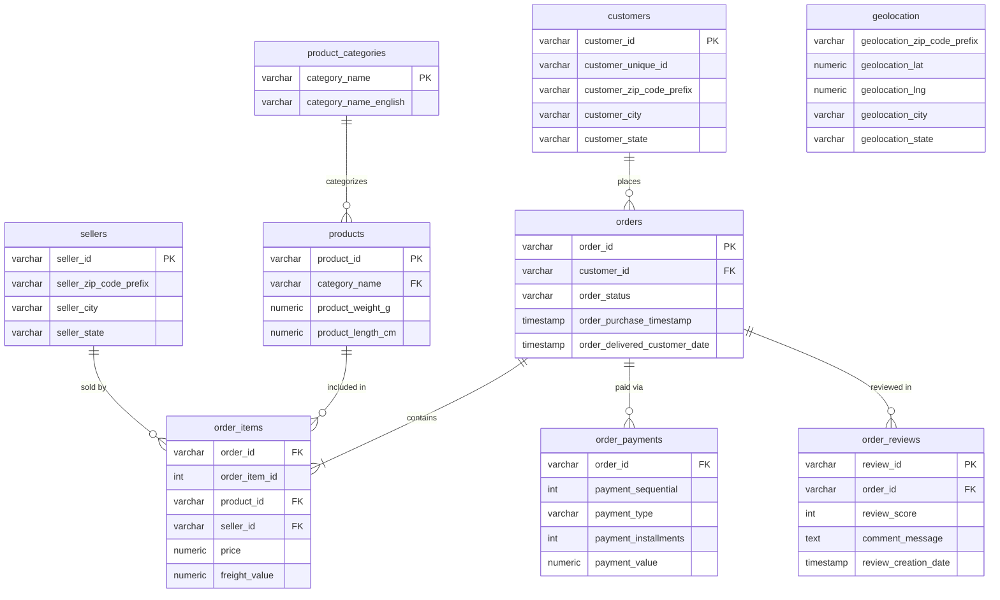
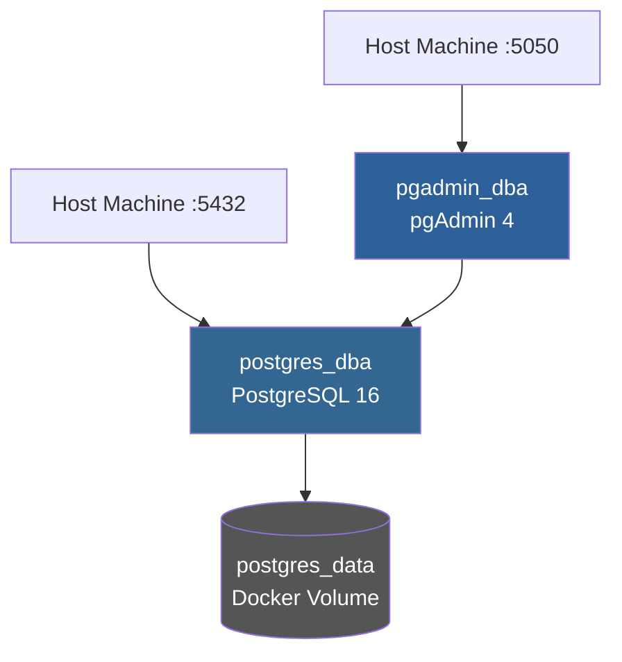

# PostgreSQL DBA Projesi — Brezilya E-Ticaret Veri Seti

> Gerçek dünya verisiyle PostgreSQL veritabanı yönetimi becerilerini gösteren uçtan uca DBA projesi.

---

## Proje Hakkında

Bu proje, 100.000+ siparişten oluşan Brezilya e-ticaret veri setini kullanarak production-benzeri bir PostgreSQL ortamı kurmayı ve aşağıdaki DBA becerilerini uygulamalı olarak sergilemeyi amaçlamaktadır:

- Veritabanı tasarımı ve normalizasyon
- CSV'den PostgreSQL'e veri aktarımı
- Sorgu performans analizi
- Index optimizasyonu
- Monitoring ve izleme
- Yedekleme ve geri yükleme
- Rol ve yetki yönetimi

---

## Teknolojiler

| Araç | Versiyon | Kullanım |
|------|----------|----------|
| PostgreSQL | 16 | Ana veritabanı |
| Docker | 28+ | Konteyner ortamı |
| pgAdmin 4 | latest | GUI yönetim arayüzü |
| Python | 3.13 | Dataset indirme scripti |
| Kaggle CLI | 2.1 | Veri seti yönetimi |

---

## Veri Seti

**Kaynak:** [Brazilian E-Commerce Public Dataset by Olist](https://www.kaggle.com/datasets/olistbr/brazilian-ecommerce) (Kaggle)

| Tablo | Kayıt Sayısı | Açıklama |
|-------|-------------|----------|
| customers | 99.441 | Müşteri bilgileri |
| orders | 99.441 | Sipariş başlıkları |
| order_items | 112.650 | Sipariş kalemleri |
| order_payments | 103.886 | Ödeme detayları |
| order_reviews | 98.410 | Müşteri değerlendirmeleri |
| products | 32.951 | Ürün kataloğu |
| sellers | 3.095 | Satıcı bilgileri |
| geolocation | 1.000.163 | Posta kodu-konum eşlemeleri |

---

## Veritabanı Şeması



## Docker Mimarisi



---

## Proje Yapısı

```
postgres-dba-ecommerce/
├── docker/
│   ├── docker-compose.yml          # PostgreSQL 16 + pgAdmin servisleri
│   └── .env.example                # Ortam değişkeni şablonu
├── sql/
│   ├── schema/
│   │   ├── 01_create_tables.sql    # Tablo tanımları ve FK kısıtlamaları
│   │   ├── 08_roles.sql            # Rol ve yetki yönetimi
│   │   └── 09_partitioning.sql     # Declarative partitioning (yıla göre)
│   ├── seed/
│   │   └── 02_import_data.sql      # CSV -> PostgreSQL veri aktarımı
│   ├── queries/
│   │   └── 03_explain_before_index.sql  # EXPLAIN ANALYZE baseline
│   ├── indexes/
│   │   └── 04_create_indexes.sql   # 11 index (B-tree + partial)
│   ├── monitoring/
│   │   ├── 05_index_monitoring.sql # pg_stat_user_indexes
│   │   ├── 06_monitoring.sql       # Aktif sorgu, cache hit, bloat izleme
│   │   ├── 10_vacuum_demo.sql      # VACUUM ANALYZE demonstrasyonu
│   │   └── pgbadger_report.html    # pgBadger log analiz raporu
│   └── backup/
│       └── 07_backup_restore.sh    # pg_dump / pg_restore
├── scripts/
│   └── download_dataset.py         # Kaggle'dan veri indirme
├── requirements.txt                # Python bağımlılıkları
└── data/
    └── raw/                        # Ham CSV dosyaları (.gitignore'da)
```

---

## Kurulum

### Gereksinimler

- Docker Desktop
- Python 3.8+
- Kaggle hesabı ve API token

### 1. Repoyu klonla

```bash
git clone https://github.com/DuyguKamalak/postgres-dba-ecommerce.git
cd postgres-dba-ecommerce
```

### 2. Kaggle API token'ını ayarla

Kaggle hesabından `kaggle.json` dosyasını indir ve aşağıdaki konuma koy:

```
Windows : C:\Users\<kullanici>\.kaggle\kaggle.json
Linux/Mac: ~/.kaggle/kaggle.json
```

### 3. Veri setini indir

```bash
pip install -r requirements.txt
python scripts/download_dataset.py
```

### 4. Docker ortamını başlat

```bash
cd docker
docker compose up -d
```

### 5. Tabloları oluştur ve veriyi yükle

```bash
# Tabloları oluştur
docker exec -i postgres_dba psql -U dba_admin -d ecommerce_db < sql/schema/01_create_tables.sql

# Veriyi import et
docker cp sql/seed/02_import_data.sql postgres_dba:/tmp/import.sql
docker exec postgres_dba psql -U dba_admin -d ecommerce_db -f /tmp/import.sql
```

### 4. Ortam değişkenlerini ayarla

```bash
cp docker/.env.example docker/.env
# docker/.env dosyasını düzenleyerek şifreleri değiştir
```

### Bağlantı Bilgileri

| Parametre | Değer |
|-----------|-------|
| Host | localhost |
| Port | 5432 |
| Database | ecommerce_db |
| Username | dba_admin |
| Password | *(docker/.env dosyasından)* |
| pgAdmin URL | http://localhost:5050 |
| pgAdmin Email | admin@dba.local |
| pgAdmin Şifre | *(docker/.env dosyasından)* |

---

## DBA Konuları (Yol Haritası)

- [x] **Faz 1** — Ortam kurulumu, dataset indirme, schema tasarımı, veri aktarımı
- [x] **Faz 2** — `EXPLAIN ANALYZE` ile sorgu analizi, 11 index oluşturuldu (128x hız artışı)
- [x] **Faz 3** — `pg_stat_*` görünümleriyle monitoring (cache hit, bloat, bağlantı takibi)
- [x] **Faz 4** — `pg_dump` / `pg_restore` ile yedekleme (35MB custom format backup)
- [x] **Faz 5** — Rol ve yetki yönetimi (`readonly_user`, `analyst_user`, `dba_admin`)
- [x] **Faz 6** — VACUUM ANALYZE ile bloat yönetimi (198K dead row temizlendi)
- [x] **Faz 7** — Declarative Partitioning (`orders` tablosu yıla göre bölündü)
- [x] **Faz 8** — pgBadger ile log analizi (HTML rapor üretildi)
- [x] **Faz 9** — Window Functions ile iş analizi (RFM, cohort, aylık trend)
- [x] **Faz 10** — Materialized View'lar (aylık satış, kategori geliri, satıcı performansı)
- [x] **Faz 11** — pg_stat_statements ile yavaş sorgu analizi
- [x] **Faz 12** — Otomatik günlük sağlık kontrol scripti (cache hit, bloat, index kullanımı)

---

## Lisans

Bu proje MIT lisansı ile lisanslanmıştır.
Kullanılan veri seti [CC BY-NC-SA 4.0](https://creativecommons.org/licenses/by-nc-sa/4.0/) lisansına tabidir.
